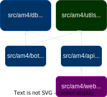
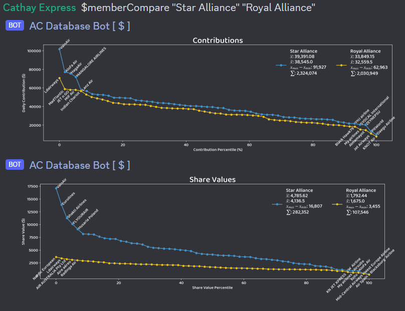
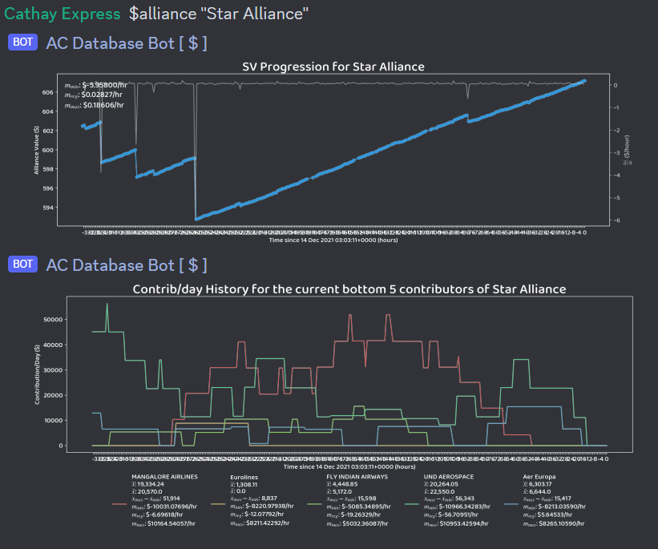

#  am4bot

[](https://discord.gg/4tVQHtf) [](https://github.com/cathaypacific8747/am4bot/actions/workflows/ci.yml)

A discord bot for the game [Airline Manager 4](airlinemanager.com), used on our [server](https://discord.gg/4tVQHtf).

Our bot is currently running legacy code under [`src-old`](./src-old/) and is being rewritten completely:
- [x] core calculations rewritten in C++ for bettter performance ([`src/am4/utils`](./src/am4/utils))
- [ ] api written in Python ([`src/am4/api (under construction)`](./src/am4/api/))
- [ ] discord bot written in Python ([`src/am4/bot (under construction)`](./src/am4/bot/))
- [ ] [`am4help.com`](https://am4help.com/) utilising this codebase ([`src/am4web (under construction)`](./src/am4/web/)to be developed)




## Installation
Clone the repo and in the root directory:
```sh
python3 -m virtualenv .venv
source .venv/bin/activate
pip install ".[api,bot]"
python3 -m src.am4 --help
```

## Features
Old bot:
- calculates essential statistics
    - most distance-efficient stopovers
    - route demands, best seat configurations, best ticket prices, estimated income
    - player rank, mode, achievements, fleet
    - alliance rank, share value, contribution
    - aircraft characteristics and profit
    - airport characteristics
- CSV export for route queries
- fuel/CO2 notifications
- aircraft characteristics comparisons
- internal *Star Alliance* tools (now disbanded)
    - adding competitor alliances to watchlist
    - alliance comparisons over time: value, contribution/day, rate of changes
    - realtime alliance-member comparisons: SV/contribution distribution
    - member tracking: cheat detection tools, departure pattern identification

## src/am4/utils Development
Recommended: C++17 compliant compiler, python3.9+

### C++ debug executable
```sh
sudo apt-get install build-essential
# optionally install vtune for profiling

cd src/am4/utils
mkdir build
cd build
cmake .. && cmake --build . --target _core_executable && ./_core_executable
```

### Python bindings
```sh
sudo apt-get install python3-dev
virtualenv .venv
source .venv/bin/activate

python3 -m pip install --verbose "src/am4/utils/.[dev]" --config-settings=cmake.define.COPY_DATA=1
pytest
cd src/am4/utils
python3 generate-stubs.py
pip3 uninstall src/am4/utils -y
```
### Build wheel
```sh
mkdir wheelhouse
python3 -m pip wheel . --wheel-dir=wheelhouse no-deps -v
pip install wheelhouse/src/am4/utils-*.whl --force-reinstall
```

## AM4 Bot development
```sh
pip3 install --verbose ".[dev]"
cp config.example.json config.production.json
PRODUCTION=1 python3 main.py
```

## Commands (for old bot - to be updated!)

### Public
- `$route|stop <airport> <airport> <aircraft> [flights_per_day] [reputation]`: finds the best route between two airports
  
  
- `$routes <airport> <aircraft> <max_distance> <flights_per_day> [reputation]`: finds the best destinations from a certain airport, sorted by decreasing estimated income
  
  
- `$user [player]`: shows player (and associated alliance if found) statistics
  
  
- `$fleet [player]`: shows player fleet and estimated income
  
  
- `$info <aircraft>`: shows basic aircraft information and rough profit estimations
  
  
- `$compare <aircraft>`: compares two aircrafts
  
  
- `$search <aircraft>`: finds the associated aircraft shortname for aircraft commands
  
  
- `$airport <airport>`: shows airport information
  
  
- `$price f[fuel_price] c[co2_price]`: notifies everyone for the fuel price
  
  

### Internal Alliance Tools
- `$memberCompare <player> <player>`: compares descending structure of contribution/day and SV
  
  
- `$alliance <alliance>`: shows AV progression and d(AV)/dt.
  
  
- `$allianceCompare <alliance> <alliance>`: compares AV progression and gap difference over time, shows 48h/12h-average contribution/day graphs
  
  
- `$member <player> [player[]]` shows contribution/day, total contribution and SV history for 1+ members
  
  
- `$actions <player> [maxResults]`: shows log of estimated departures, contributions and income
  
  
- `$watchlist [add|+, remove|rm|-] [alliance]`: shows, adds or remove alliance(s) to the watchlist