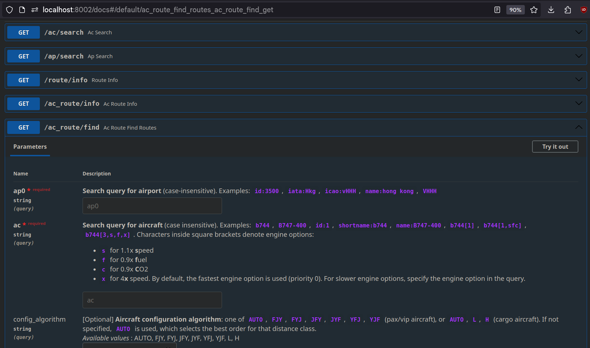

!!! important
    The [core](./core.md) must be built before running the API.

### Web API
The core are exposed to the web using [FastAPI](https://github.com/tiangolo/fastapi). Validation on query params/body is handled by [Pydantic](https://github.com/pydantic/pydantic) models defined under [`src/am4/db/models`](https://github.com/cathaypacific8747/am4/tree/master/src/am4/db/models/).

To start it, use:
```sh
python3 -m src.am4 start api
```
it should be running on `http://localhost:8002` and look like this:

