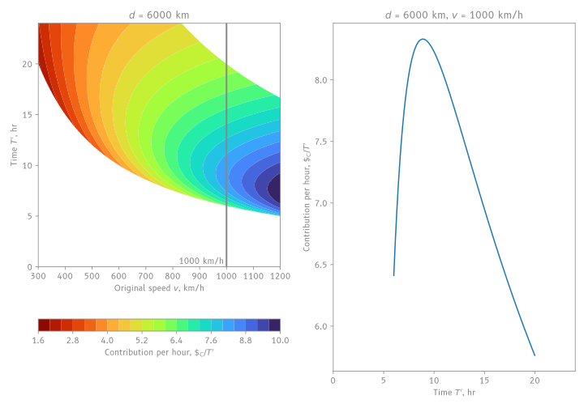

> I want to achieve maximum contribution per day in an alliance: what schedule should I fly, or what variables are the most important?

This guide covers:

- constructing objective functions and performing optimisation with derivatives
- arrive at a optimal pure-contribution strategy

!!! example "Experimental"
    This guide is a preview and not finalised!

## Advanced

### Optimisation

First, list out all independent and dependent variables we should consider:

<figure markdown="span">
  
</figure>

We know from collecting data that, if we decrease the $\text{CI}\downarrow$:

- the contribution $\$_{\text{C}}\uparrow$
- but at the same time, the aircraft speed $v'\downarrow$ and also, flight time $T'\uparrow$

We also found that increasing distance $d\uparrow$ will cause the contribution $\$_{\text{C}}\uparrow$ and flight time $T'\uparrow$.

Now what happens to the *contribution per hour* $\frac{\$_{\text{C}}}{T'}$? Well, it'll always increase, if we **assume** that contribution (numerator) grows faster than the flight time (denominator).

But how do we test if our assumption is true? **We need calculus.**

Also, if I want to increase my *contribution per hour*, should I prefer increasing the distance, or decreasing the CI? Hmm... they both decrease the flight time and increase the contribution in different ways... **We need calculus.**

### Objective Function $J$

When we have multiple equations, we should try to combine them into one equation, which gives us a *singular output*. Why? It is easier to perform **differentiation** on it, which will be key to understanding how one variable affects the other.

Now, our goal is to make one equation, that outputs the *contribution per hour* given distance $d$, $\text{CI}$ and $v$. We call this the **objective function** $J$. It's really useful because we can try to calculate $\frac{\partial J}{\partial \text{CI}}=0$ to find the optimal CI (more on this later).

But let's deviate a bit before proceeding. As route planners, CI is something we set *after* we know the route and target flight time $T'$. It'd be more useful to know contribution as a function of $d$, $T'$ and $v$ instead. To do this, we need three [formulae](../formulae.md):

- relationship between speed, distance and time
- relationship between new speed, original speed and CI
- the contribution formula.

Let's first combine the first two, then work our way to the third.

??? question "Exercise 7: Suppose I have an aircraft with speed $v$ flying a distance $d$. What CI do I need to set to get a flight time of $T'$? Write an equation for it and the interval for which it is valid."
    
    When [CI](../formulae.md#ci) is applied, the new speed is
    
    $$
    \begin{equation}
    v' = v(0.0035\text{CI} + 0.3)
    \end{equation}
    $$
    
    Speed $v$ is defined as the distance flown $d$ over flight time $T$:
    
    $$
    \begin{equation}
    v = \frac{d}{T}
    \end{equation}
    $$
    
    Rearranging Eq 1 for CI and substituting Eq 2 for $v'$:
    
    $$
    \begin{align*}
    \text{CI} &= \frac{\frac{v'}{v}-0.3}{0.0035} \\
    &= \frac{2000d}{7vT'}-\frac{600}{7}
    \end{align*}
    $$

    This formula is only valid when $0 \le \text{CI} \le 200$, simplifying:
    
    $$
    \begin{align*}
    0 &\le \frac{2000d}{7vT'}-\frac{600}{7} \le 200 \\
    0 &\le \frac{2000d}{vT'}-600 \le 1400 \\
    600 &\le \frac{2000d}{vT'} \le 2000 \\
    0.3vT' &\le d \le vT' \\
    \end{align*}
    $$

Again, our goal is to express the objective function $J$ with inputs $d$, $v$, $T'$. So far, we have done so for $\text{CI}$ and it's time to do the same for $J$.

??? question "Exercise 8: Find $J(d, v, T')$ by combining the contribution formula and CI."

    The [contribution formula](../formulae.md#contribution) is:

    $$
    \begin{equation}
    \$_\text{C} = \min\left( k_\text{gm}kd\left(1 + \frac{2(200 - \text{CI})}{200}\right),152 \right)
    \end{equation}
    $$

    $$
    \begin{equation}
    \begin{align*}
    k_\text{gm} &= \begin{cases}
        1.5 & \text{if realism} \\
        1 & \text{if easy}
    \end{cases} \\
    k &= \begin{cases}
        0.0064 & \text{if } d < 6000 \\
        0.0032 & \text{if } 6000 < d < 10000 \\
        0.0048 & \text{if } d > 10000 \\        
    \end{cases}
    \end{align*}
    \end{equation}
    $$

    We can get rid $\text{CI}$ using the formula we found earlier:

    $$
    \begin{equation}
    \text{CI} = \frac{2000d}{7vT'}-\frac{600}{7}, d \in [0.3vT', vT']
    \end{equation}
    $$

    Now simplifying our objective function $J = \$_\text{C} / T'$:

    $$
    \begin{align*}
    J(d, v, T') &= \min\left(\frac{k_\text{gm}kd}{T'}\left(3 - \frac{\text{CI}}{100}\right), \frac{152}{T'} \right) \\
    &= \min\left(\frac{k_\text{gm}kd}{T'}\left(\frac{27}{7} - \frac{20d}{7vT'}\right), \frac{152}{T'} \right) \\
    &= \min\left(\frac{27k_\text{gm}kd}{7T'} - \frac{20k_\text{gm}kd^2}{7vT'^2}, \frac{152}{T'} \right)
    \end{align*}
    $$

    For the remainder the guide, I will assume easy mode, with $k_{\text{gm}}=1$.

Great! Now we $J$ as a single **multivariable function** with 3 variables.

We want to understand the relationships between variables, and plotting is always a great way to understand things. Unfortunately, we cannot quite visualise everything at once because we don't have 4 dimensions!

But if we *freeze* any one variable constant, $J$ now has 2 independent variables ("inputs") and one dependent variable ("output"). For instance, when we have three inputs $(d, v, T')$, we choose to freeze $d=6000$ as a constant, then $(v, T')$ are the two remaining inputs. Now, set $v$ as the x-axis, $T'$ as the y-axis - and compute $J$ for *every single combination* and colour it: 

<figure markdown="span">
  
</figure>

This is called a [**contour plot**](https://en.wikipedia.org/wiki/Contour_line). Here, we can observe "bands" of the same colour - imagine walking on a hill: walking along this path does not change your elevation. In this case, the region of the darkest blue all have the same value: the best contribution per hour.

??? question "Exercise 9: If you are familiar with Python, can you reproduce the graph above? (hint: you might want to use `np.minimum` for CI bounds-checking, `np.where` for the piecewise $k$ and `matplotlib` for plotting.)"

    I've written the `ci` and `cont` functions separately. Try changing `ci` to `cont`!

    ```py linenums="1"
    --8<-- "formulae.py:cont-plot"
    
    plt.show()
    ```

You can view the middle plot on [Desmos 3D](https://www.desmos.com/3d/3c13b7df43) as well.

??? question "Concept Check: Just by looking at the contour plot, how do we achieve the highest contribution per hour?"
    
    The highest contribution per hour are regions with the darkest blue:
    
    - Left Plot, constant $d$:
        - faster original aircraft speed $v$
        - shorter target flight time $T'$. *but if it is too short, it'll get worse*
    - Middle Plot, constant $v$:
        - choose distances less than 6000km
        - *along some linear line, they all have equally good contribution per hour*
    - Right plot, constant $T$ for a 12hr departure schedule and $v=1200$:
        - when $d<6000$, greater distances perform better.
        - when $d>10000$, greater distances perform poorer.
    
    I'm being quite ambiguous here: we will see later how to know "when it's too short" or how to calculate the "linear line".

Now, we want to know **what is the equation that gives me the darkest blue region**?

To answer it, imagine yourself blindfolded, at the red region (bottom of the hill) and wanting to reach the "peak". The strategy would be, *climb whatever direction with the steepest slope*. If we follow it long enough, we will find ourselves confused because there are no more slopes to climb - that's the peak!

The direction with the steepest ascent is called the [**gradient**](https://en.wikipedia.org/wiki/Gradient) $\nabla J$. It is a vector that tells me which direction to go:

$$
\nabla J=\left[\begin{array}{c}
\frac{\partial J}{\partial d} \\
\frac{\partial J}{\partial v} \\
\frac{\partial J}{\partial T'}
\end{array}\right]
$$

When $\nabla J=\left[\begin{array}{c}0 \\ 0 \\ 0\end{array}\right]$, it means we should stop moving because it holds the position of the plateau - the **critical point**.

The $\frac{\partial J}{\partial d}$, $\frac{\partial J}{\partial v}$ and $\frac{\partial J}{\partial T'}$ are the **partial derivatives** of $J$. Setting them all equal to zero gives us the critical point.


### Partial Derivatives

Finding partial derivatives of $J$ is effectively the same as the ordinary derivatives, but you *freeze* all but one variable fixed.

#### Case 1: Optimal $T'$

To find the optimal time, we need to freeze $d$ and $v$ to "collapse" it to a single-variable function. We can do so by taking the leftmost plot (which already froze $d=6000$) then freezing $v=1730.85$ (taking a slice with grey line):

<figure markdown="span">
  
</figure>

The green line here indicates the optimal time that maximises $J$: our goal is to find this value.

The plot on the right represents $J(d=6000, v=1730.85, T')$, a single variable function.

Remember earlier in our concept check, we said "shorter flight time will yield higher contribution per hour, *but if it is too short, it'll get worse*"? Indeed, it increases up until some point $T'_\text{optimal}$ then drops dramatically: this point can be found with partial derivatives.

!!! note "Example: For an A388 with speed mod ($v=1730.85$) and $d=6000$, find the optimal target flight time $T'_\text{optimal}$ that maximises $J$. Verify your answer on the plot."

    We would like to evaluate the location at which $\frac{\partial J}{\partial T'}=0$.

    Recall $J$:

    $$
    J = \min\left(\frac{27kd}{7}T'^{-1} - \frac{20kd^2}{7v}T'^{-2}, 152T'^{-1} \right)
    $$

    Treat $d, v, k$ here as numbers and differentiate with respect to $T'$, using $\frac{d}{dT'}(T'^n) = nT'^{n-1}$:

    $$
    \frac{\partial J}{\partial T'} = \min\left(-\frac{27kd}{7T'^2} + \frac{40kd^2}{7vT'^3}, -\frac{152}{T'^2} \right)
    $$

    Setting it to 0 yields:

    $$
    \begin{align*}
    \frac{27kd}{7T'^2} &= \frac{40kd^2}{7vT'^3} \\
    27 &= \frac{40d}{vT'} \\
    T' &= \frac{40d}{27v} = \frac{40 \cdot 6000}{27 \cdot 1730.85} = 5.135
    \end{align*}
    $$

    This gives us the time at which the contribution is maximised[^1]. It indeed matches with the green vertical line! We can also evaluate $J$ at this point:

    $$
    \begin{align*}
    J(T'_\text{optimal}) &= \min\left(\frac{27kd}{7}\cdot\frac{27v}{40d} - \frac{20kd^2}{7v}\cdot\frac{27^2v^2}{40^2d^2}, 152\cdot\frac{27v}{40d} \right) \\
    &= \min\left(\frac{729}{560}kv, \frac{102.6v}{d} \right) \\
    &= \min\left(\frac{729 \cdot 0.0064 \cdot 1730.85}{560}, 29.588\right) = 14.420
    \end{align*}
    $$
    
    Indeed, this also matches the plot!
    

We now reach a very useful equation:

$$
T'_{\text{optimal}} = \frac{40d}{27v} \\
$$

This gives us the optimal* time, given some distance $d$ and original aircraft speed $v$. The contribution per hour at this time is also:

$$
J(T'_\text{optimal}) = \min\left(\frac{729}{560}kv, \frac{102.6v}{d} \right)
$$

!!! warning "Important note on optimality"

    By optimal, I mean *locally* optimal.

    If we had just arbitrarily chosen $d=6000$ and $v=1000$, we cannot guarantee that the contribution is the absolute max!

    If we can prove $d$ and $v$ is indeed optimal, using this equation will give us *globally optimal* contribution. We do that by also evaluating partial derivatives with respect to $v$ and $d$.

I can now find all optimal times $T'_{\text{optimal}}$ at all speeds $v$ and plot them with a green line:

<figure markdown="span">
  
</figure>

Notice that this line is the "ridge" of our mountain that maximises $J$! If we also make regularly spaced cuts along the speed $v$, we can clearly see that the green dots correspond to the locally optimal $T'_{\text{optimal}}$ in that cut.

#### Case 2: Optimal $d$

coming soon™ ;)

#### Case 3: Optimal $v$

coming soon™ ;)

### Interesting Properties

<!-- Recall in single variable calculus, for a function $f(x)$ defined in the interval $x \in [a, b]$ we'd need to check the endpoints $f(a)$ and $f(b)$ as well. Similarly, in multivariable calculus, we need to check the boundary values of the domain. -->

<!-- Additionally, finding $\nabla J$ is not enough. We also need to check the [Hessian matrix](https://en.wikipedia.org/wiki/Hessian_matrix) to determine if the critical point is a local maximum, minimum, or saddle point. -->

??? question "Exercise 10: What is the optimal CI to achieve maximum contribution *per hour*? Assume we are flying distances less than 6000km. (Tip: Notice that the objective function is different because we now take CI as the input.)"
    
    Recall the [contribution formula](../formulae.md#contribution) is:

    $$
    \$_\text{C} = \min\left( kd\left(1 + \frac{2(200 - \text{CI})}{200}\right),152 \right)
    $$

    The objective function $J$ should take in $\text{CI}$ and $T'$ only. Define it to be $\$_\text{C}/T'$ and substitute $d=v'T'=T'v(0.0035\text{CI}+0.3)$:

    $$
    \begin{align*}
    J(\text{CI}, T') &= \min\left( kv(0.0035\text{CI}+0.3)\left(3 - \frac{\text{CI}}{100}\right),\frac{152}{T'} \right) \\
    &= \min\left( kv(0.0105\text{CI} + 0.000035\text{CI}^2 + 0.9 - 0.003\text{CI}),\frac{152}{T'} \right) \\
    &= \min\left( kv(\underbrace{-0.000035\text{CI}^2 + 0.0075\text{CI} + 0.9}_{\text{a quadratic function!}}),\frac{152}{T'} \right)
    \end{align*}
    $$

    Now, to find the global maxima, we need $\frac{\partial J}{\partial \text{CI}}$ and the boundary points. First, the partial derivative of $J$ with respect to $\text{CI}$ (note that $k$ is a piecewise function returning a *constant* so $\frac{\partial k}{\partial \text{CI}} = 0$):

    $$
    \frac{\partial J}{\partial \text{CI}} = \begin{cases}
        kv \left(-0.00007\text{CI} + 0.0075\right) & \text{if } J < 152 \\
        0 & \text{otherwise} \\
    \end{cases}
    $$

    For a fixed target flight time $T'$, this is a decreasing function (as $\frac{\partial^2 J}{\partial \text{CI}^2} < 0$), meaning that contribution grows with CI initially, but slowly plateaus off and starts decreasing. This is the **local maxima** and can be found by solving for $\frac{\partial J}{\partial \text{CI}} = 0$:

    $$
    \begin{align*}
    kv(-0.00007\text{CI}+0.0075) &= 0 \\
    \text{CI} &= \frac{-0.0075}{-0.00007} = 107.143
    \end{align*}
    $$

    Interestingly, a CI of 107 is guaranteed to be the *local optimum*, regardless of aircraft speed! In the particular case where $d<6000$, it is the global optima because $k$ is the largest. But we need to be more careful for $d>6000$: it is possible to get a better contribution if we had chosen $d=6000$.

### Mixed Strategies

!!! question "Exercise 11: Reducing CI obviously increases contribution, but decreases profit. Some players like to choose a hybrid contribution-profit strategy: say $k_c = 0.4$ means 40% profit, 60% contribution. Formulate an objective function and comment on the optimal strategy."

    coming soon™ ;)


### Summary

- identify all IVs, DVs and Combine equations into a single objective function $J$.
- contour plots are helpful to visualise combinations of variables.
- gradient $\nabla J$ is the direction of steepest ascent, solving for zero corresponds to critical points
- partial derivatives freeze all but one variable constant.
- if $f(x, y)$ and $x(t), y(t)$, $\frac{dz}{dt}=\frac{\partial z}{\partial x}\frac{dx}{dt}+\frac{\partial z}{\partial y}\frac{dy}{dt}$, forming a tree.
- evaluate the nature of critical points with Hessian and check boundaries for global maxima.

[^1]: Technically, we should also check that $\frac{\partial^2 J}{\partial T'^2}<0$ to verify that it is indeed concaving downwards, and is thus the maximum.