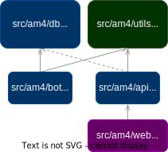

#  Airline Manager 4

[Airline Manager 4](https://airlinemanager.com) is an online multiplayer game whose goal is to build an airline from scratch. Rapid progression in the game requires thorough market research and route planning to high demand destinations, while considering recurring fuel/CO2 costs, and conforming to aircraft range/runway requirement constraints.

The weekly leaderboards and alliances are highly competitive arenas which require extensive knowledge in the game: this repository contains a set of high-performance foundational tools, built for the more technical-oriented players. The project is structured as follows:

- [x] core calculations written in C++ for exhaustive searches ([`src/am4/utils`](https://github.com/cathaypacific8747/am4/tree/master/src/am4/utils))
- [x] a Python web API exposing the core ([`src/am4/api`](https://github.com/cathaypacific8747/am4/tree/master/src/am4/api/))
- [x] an sqlite database storing user settings ([`src/am4/db`](https://github.com/cathaypacific8747/am4/tree/master/src/am4/db/)) 
- [x] a Python discord bot for our community ([`src/am4/bot`](https://github.com/cathaypacific8747/am4/tree/master/src/am4/bot/))
- [ ] [`am4help.com`](https://am4help.com/): a SolidJS frontend calling the API (under construction, [`src/am4/web`](https://github.com/cathaypacific8747/am4/tree/master/src/am4/web/))

<figure markdown="span">
    
</figure>

