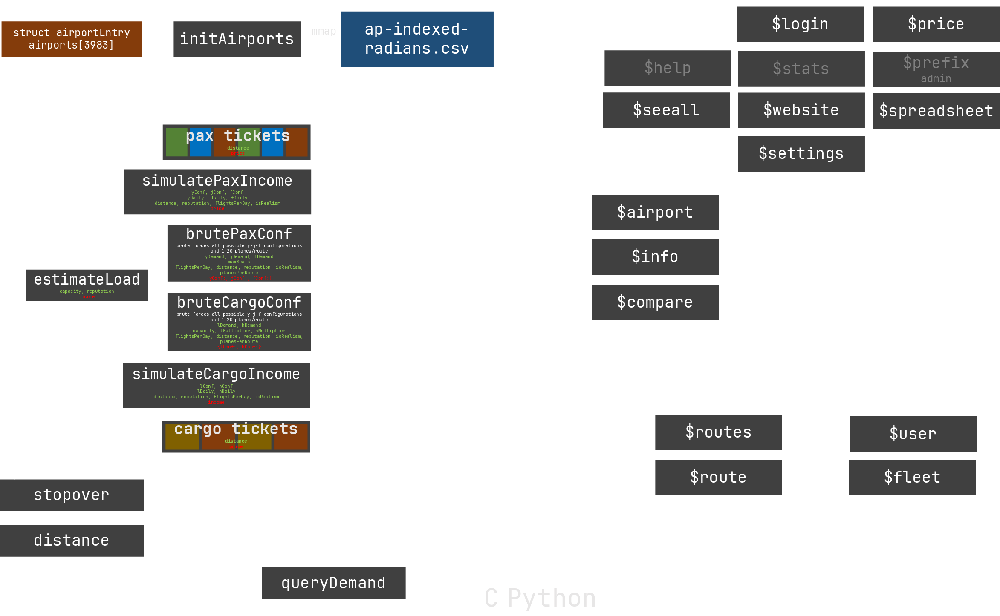

# Old versions

This folder contains old versions of the am4 bot:
- v1 (2019 - early 2020)
- v2 (Dec 20 - Apr 21): attempts to write in in C (`v2/helper_c.c`) then eventually in Cython (`helper_cy.pyx`)
- v3 (Mar 22): modern Python rewrite, abandoned due to lack of time

These versions are completely abandoned and serve as archival purposes only, they will be removed once everything is migrated.



## Installation
```
$ sudo apt-get update
$ cp .env.template .env
$ pip3 install -r requirements.txt
$ python3 main_v3.py
```

Edit `.env` accordingly.